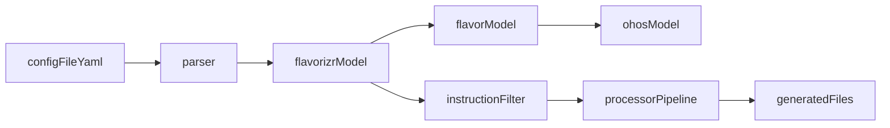

# Flutter Flavorizr HarmonyOS 适配技术需求文档

## 1. 背景与目标

`flutter_flavorizr` 当前主要面向 `android / ios / macos` 三个平台的 flavor 生成。仓库内已出现 `ohos` 相关模型雏形，但尚未形成完整可用链路。为了支持 HarmonyOS 的多目标、多产品构建能力，需要先定义统一的技术需求与详细设计，作为后续实现、测试与验收依据。

本文档目标：
- 明确 HarmonyOS（以下简称 OHOS）在 `flutter_flavorizr` 中的配置模型、解析规则和处理器链路。
- 将官方“多目标/多产品定制”能力映射到本库术语：`flavor / instruction / processor`。
- 定义阶段性落地策略、测试方案与验收标准。

## 2. 现状基线与差距

### 2.1 现状（代码事实）

- 已有 OHOS flavor 模型：`lib/src/parser/models/flavors/ohos.dart`
- 已有 `ohosFlavors` 聚合字段：`lib/src/parser/models/flavorizr.dart`
- 但 `Flavor` 主模型尚未声明 `ohos` 字段：`lib/src/parser/models/flavors/flavor.dart`
- `ohos.g.dart` 不存在，说明尚未完成序列化链路生成
- 默认指令集暂无 `ohos:*`，且指令过滤不含 `ohos`：`lib/src/processors/processor.dart`
- README 暂无 OHOS 字段与指令说明：`README.md`

### 2.2 关键差距（问题陈述）

1. **数据模型链路未闭环**：`Flavorizr -> Flavor -> Ohos` 未完整串通。  
2. **处理器链路未定义**：无 OHOS 指令命名、顺序、依赖。  
3. **文档/示例缺失**：用户无法按规范配置 OHOS flavor。  
4. **测试覆盖不足**：缺少 OHOS 解析、指令过滤与产物验证测试。  

## 3. 范围定义

### 3.1 In Scope

- 解析层：`Parser`、`Pubspec`、`Flavorizr`、`Flavor` 与 `Ohos` 的配置解析闭环
- 模型层：OHOS 字段定义、默认值、必填校验、反序列化要求
- 处理器编排层：`ohos:*` 指令设计、注册、默认执行顺序、依赖约束
- 文档层：新增 OHOS 配置与执行文档（本需求文档 + README 后续补充点）
- 测试层：单测、集成测试、回归测试清单

### 3.2 Out of Scope

- 一次性完成全部 HarmonyOS 工程模板资产重构（可分阶段推进）
- 与 OHOS 无关的平台行为改造（Android/iOS/macOS 业务逻辑调整）
- DevEco Studio 插件化能力扩展（如 IDE 自动化操作）

## 4. 官方能力映射与术语对齐

HarmonyOS 官方文档强调“多目标/多产品”构建，本质是同一代码基线通过配置切换构建产物。映射到本库：

- 官方 `products`（多产品定义） -> 本库 `flavors`（多环境/多产物定义）
- 官方构建配置字段（如签名、构建变量） -> 本库 flavor 下 `ohos` 子配置
- 官方产物切换 -> 本库 instruction 流水线按 flavor 生成目标文件/配置

参考：
- [HarmonyOS 多目标多产品定制指南](https://developer.huawei.com/consumer/cn/doc/harmonyos-guides/ide-customized-multi-targets-and-products-guides)
- [HarmonyOS 多目标多产品示例](https://developer.huawei.com/consumer/cn/doc/harmonyos-guides/ide-customized-multi-targets-and-products-sample)

## 5. 配置模型需求（YAML 契约）

## 5.1 顶层结构

保持现有 `flavors` 主结构不变，在每个 flavor 下新增 `ohos` 节点。

```yaml
flavors:
  dev:
    app:
      name: "Demo Dev"
    ohos:
      applicationId: "com.example.demo.dev"
      customConfig:
        productName: "dev_debug"
        apiHost: "https://dev-api.example.com"
      resValues:
        app_name:
          type: "string"
          value: "Demo Dev"
      buildConfigFields:
        environment:
          type: "String"
          value: "\"dev\""
      agconnect: "agconnect/dev/agconnect-services.json"
```

## 5.2 字段定义

OHOS flavor 字段定义（基于现有 `Ohos` 模型）：

| 字段 | 类型 | 必填 | 默认值 | 说明 |
|---|---|---|---|---|
| `applicationId` | `String` | 是 | 无 | OHOS 应用标识（唯一） |
| `customConfig` | `Map<String, dynamic>` | 否 | `{}` | 自定义构建参数，用于映射官方多产品字段 |
| `resValues` | `Map<String, ResValue>` | 否 | `{}` | 资源值注入 |
| `buildConfigFields` | `Map<String, BuildConfigField>` | 否 | `{}` | 构建期常量注入 |
| `agconnect` | `AGConnect?` | 否 | `null` | 华为服务配置 |
| `icon`/`adaptiveIcon` 等 | 继承现有 OS/Android 语义 | 否 | `null` | 图标策略按后续处理器支持程度启用 |

## 5.3 校验规则

- `applicationId` 必填且非空字符串。
- `customConfig` 仅允许对象类型；标量/数组应报错。
- `resValues` 与 `buildConfigFields` 的子项必须满足既有模型校验（`type/value` 等）。
- 未知字段策略：先保持兼容（忽略未知字段），通过文档约束推荐字段。

## 6. 解析与聚合链路详细设计

## 6.1 数据流



## 6.2 模型改造要求

1. `Flavor` 增加 `ohos` 字段（可选）：  
   - 文件：`lib/src/parser/models/flavors/flavor.dart`
2. 修正 `Flavorizr` 中 `ohosFlavors` 过滤逻辑：  
   - 由 `flavor.macos != null` 改为 `flavor.ohos != null`
3. 增加 `ohosFlavorsAvailable` 判定 getter：  
   - 用于指令过滤层
4. 重新生成相关 `*.g.dart` 文件：  
   - `flavor.g.dart`、`flavorizr.g.dart`、`ohos.g.dart`（若新建/变更）

## 6.3 兼容性约束

- 不影响现有 `android / ios / macos` 配置解析路径。
- 对不含 `ohos` 的旧配置，执行结果与当前版本一致。

## 7. 处理器与指令体系需求

## 7.1 指令命名规范

建议新增以下最小可用指令集合（MVP）：

- `ohos:config`：生成/更新 OHOS flavor 基础配置
- `ohos:products`：将 flavor 映射为多产品构建配置
- `ohos:icons`：可选，处理图标产物（若资产链路准备完成）

命名规则：`<platform>:<action>`，与现有 `android:* / ios:* / macos:*` 保持一致。

## 7.2 默认执行顺序（建议）

1. `assets:download`
2. `assets:extract`
3. `ohos:config`
4. `ohos:products`
5. `huawei:agconnect`（可复用或扩展为 OHOS 目标目录）
6. `ohos:icons`（可选）
7. `assets:clean`

## 7.3 依赖与幂等性要求

- `ohos:*` 指令仅在 `ohosFlavorsAvailable == true` 时执行。
- `ohos:products` 依赖 `ohos:config` 成功执行。
- 每次重复运行必须得到同构结果（无重复块、无叠加脏数据）。
- `ohos:products` 在合并已有 `products` 数组时，必须保留非 flavorizr 管理条目，仅覆盖同名 `name` 的条目（支持多人协作下的增量合并）。
- 指令失败时输出明确失败点，不应静默吞错。

## 8. 文档与示例需求

后续需在以下文件补充 OHOS 内容（本次先定义要求，不直接改这些文件）：

- `README.md`：新增 `ohos` 字段定义、指令列表、最小示例、执行说明
- `example/flavorizr.yaml`：新增一组 `ohos` 示例配置
- `CHANGELOG.md`：记录 OHOS 支持能力与阶段范围

## 9. 测试方案

## 9.1 单元测试

目标文件（建议）：
- `test/source_test.dart`（解析入口）
- `test/parser/...`（若拆分更细粒度）
- `test/processors/...`（OHOS 指令处理器）

覆盖点：

1. **解析成功路径**
   - `flavorizr.yaml` 含 `ohos.applicationId` 时可成功解析
   - `ohosFlavors` 正确聚合
2. **解析失败路径**
   - 缺失 `applicationId` 抛出缺必填异常
   - `customConfig` 类型错误抛出类型异常
3. **指令过滤路径**
   - 无 `ohos` flavor 时跳过 `ohos:*`
   - 有 `ohos` flavor 时仅执行可用 OHOS 指令
4. **回归路径**
   - 仅 Android/iOS/macOS 配置仍可正常运行

## 9.2 集成验证

- 使用样例配置执行 `flutter pub run flutter_flavorizr`，确认：
  - OHOS 目标配置文件生成/更新成功
  - 指令执行顺序符合预期
  - 重复执行无副作用

## 10. 验收标准（Definition of Done）

满足以下全部条件视为验收通过：

1. 解析链路支持 `flavor -> ohos`，并通过单测。
2. 默认指令集可识别并按条件执行 `ohos:*`。
3. README 和示例配置提供可复制的 OHOS 最小示例。
4. 回归测试确认旧平台行为无破坏。
5. 关键错误场景有明确异常提示和失败日志。
6. `ohos:products` 合并规则满足“同名覆盖、异名保留”，并通过幂等测试验证。

## 11. 风险与迁移策略

### 11.1 主要风险

- 共享 `android` 模型语义导致 OHOS 字段语义歧义
- `huawei:agconnect` 现有目标目录可能偏 Android，OHOS 需补齐映射
- 资产模板（icons/config）不完整导致初期指令能力不足

### 11.2 迁移策略

- 阶段 1（模型闭环）：仅打通解析与聚合，不默认启用复杂处理器
- 阶段 2（指令接入）：引入 `ohos:config / ohos:products` 并补测试
- 阶段 3（文档公开）：README/示例/变更日志齐备后正式发布

### 11.3 向后兼容策略

- 旧配置无需修改即可继续使用。
- 新增字段均为增量能力，不破坏已有配置键。
- 对非推荐字段先告警后再考虑强校验（分版本推进）。

## 12. 里程碑建议

- M1：模型与解析打通（含生成文件与解析单测）
- M2：处理器最小链路可用（`ohos:config`、`ohos:products`）
- M3：文档与示例完整、回归通过、发布说明准备完成

## 13. 参考资料

- [HarmonyOS 多目标多产品定制指南](https://developer.huawei.com/consumer/cn/doc/harmonyos-guides/ide-customized-multi-targets-and-products-guides)
- [HarmonyOS 多目标多产品示例](https://developer.huawei.com/consumer/cn/doc/harmonyos-guides/ide-customized-multi-targets-and-products-sample)
